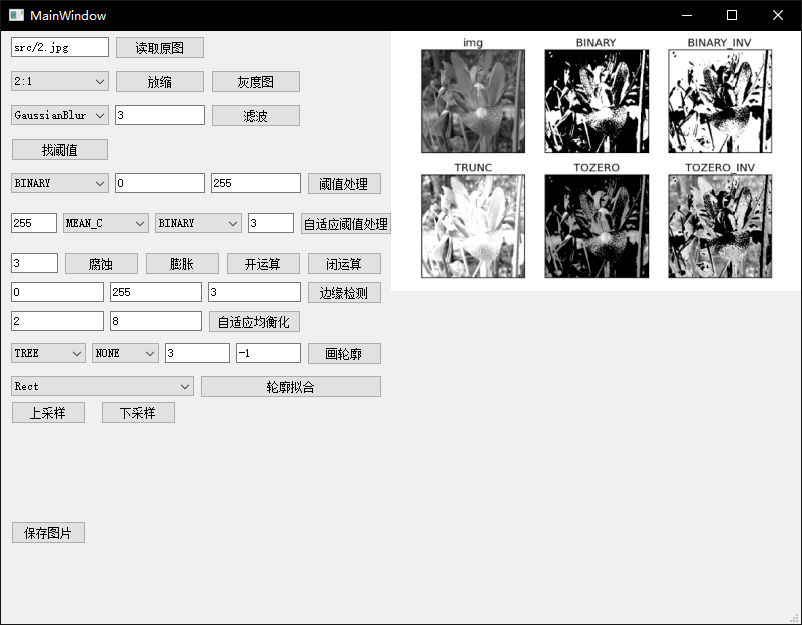

分布式高并发商品秒杀系统

- [介绍](#介绍)
- [快速启动](#快速启动)
- [TODO](#TODO)
- [Q&A](#Q&A)
- [参考资料](#参考资料)


## 介绍

本项目构建了一个简易的图像理界面软件，主要是为了快速、方便的进行机器视觉项目的开发，减少代码调试的工作量。


#### 具备的功能

1. **缩放处理**。
2. **图像滤波**。
3. **阈值处理**。
4. **形态学操作**。
5. **边缘检测**。
6. **轮廓拟合**。

## 快速启动

- 主要依赖

  | ⚔️                                                 |
  | ------------------------------------------------- |
  | [`PyQt==5.15.0`](https://pypi.org/project/PyQt5/5.15.0/)
  | [`Python3`](https://www.python.org/)
  

- 其他工具

   [`QT designer`](https://doc.qt.io/qt-5/qtdesigner-manual.html)
    
运行项目：
```properties
python CvGui.py
```

## `TODO`

- 操作撤销功能

- 交互优化

## Q&A

- 关于开运算与闭运算
    - 开运算可以减少细节，让目标更加突出。闭运算可以增加细节，让目标更加完整、丰富。
    - 开运算是消除白色物体外的小黑点，闭运算是填充白色物体内部的小黑点
    - 开运算能够除去孤立的小点，毛刺和小桥，而总的位置和形状不便。闭运算能够填平小湖（即小孔），弥合小裂缝，而总的位置和形状不变。
    - 先腐蚀再膨胀 去掉无关小细节 去除噪声

- 一般处理流程
    - 原图-放缩-灰度-滤波-开运算-边缘检测-轮廓检测


## 参考资料

-  略


